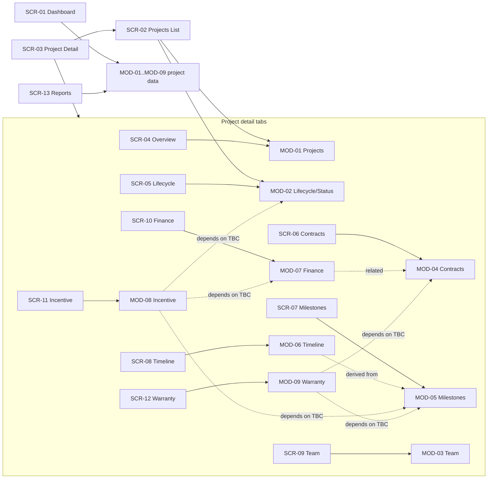

# Project Management System — Information Architecture (PM-001)

> **Status: specification (documentation only).** This document defines the information
> architecture of the Project Management System **before any product feature is
> implemented**. It is the structural baseline that all subsequent feature issues build
> against.
>
> **No UI is implemented and no application source code is changed by this document.**
> Component and token names below are references to what already exists in the UI template
> (`packages/ui`, `packages/ui/theme/`, `apps/web/tailwind.config.js`), used to describe
> structure — not an implementation plan.
>
> **Sources:**
>
> - Business facts: [`project-management-domain-spec.md`](project-management-domain-spec.md)
>   (§1 scope, §2.1–§2.11 domain areas, §3 confirmed UI direction). Facts not confirmed
>   there are marked **To be confirmed (TBC)** here and must not be treated as decided.
> - Operating rules: [`../../CLAUDE.md`](../../CLAUDE.md) (§4 UI/UX rules, §5 coding rules).
> - Companion documents: [`user-role-matrix.md`](user-role-matrix.md) (roles, permissions,
>   navigation visibility) and [`screen-specification.md`](screen-specification.md)
>   (per-screen specification, keyed by the screen IDs defined here).
>
> Consolidated TBC list for the product owner: see [§11](#11-consolidated-to-be-confirmed-list).

---

## 1. Purpose and scope

The Project Management System (PMS) is an internal system to manage organizational project
information end to end (domain spec §1). This document answers, at structure level:

- which **modules** the system consists of, mapped to the 11 confirmed domain areas;
- how the application is **navigated** (primary navigation, secondary navigation,
  breadcrumbs, global elements);
- the **structure of the management dashboard** (spec §2.11);
- the **structure of the projects list** (readable-table pattern per `CLAUDE.md` §4);
- the **structure of the project detail area**, covering every detail area from the spec;
- how **screens and modules depend on each other**.

Out of scope: visual pixel design, component code, route implementation, data models, and
API design. Authentication, users/roles, notifications, and integrations are TBC (spec §1);
their structural placeholders are noted where the navigation depends on them.

---

## 2. Module map

The 11 confirmed scope areas (spec §1) map to system modules as follows. The mapping
distinguishes **project-scoped modules** — areas the spec describes as belonging to an
individual project (e.g. "each project has a project manager and team members", §2.3;
"financial information per project", §2.7) — from **cross-project modules**, which operate
over the whole portfolio (Reports §2.10, Management dashboard §2.11).

| Module ID | Module                            | Domain spec | Scope          | Confirmation status                                                                                                                                           |
| --------- | --------------------------------- | ----------- | -------------- | ------------------------------------------------------------------------------------------------------------------------------------------------------------- |
| MOD-01    | Projects                          | §2.1        | Cross-project  | Confirmed as the core entity; identifying fields, creation rights, types/categories, project relations, archiving — TBC                                       |
| MOD-02    | Project lifecycle / status        | §2.2        | Project-scoped | Confirmed that every project has a lifecycle state; status list, transitions, approval, downstream effects — TBC                                              |
| MOD-03    | Team (project managers & members) | §2.3        | Project-scoped | Confirmed that each project has a PM and team members; sourcing of people, team roles, allocation, history — TBC                                              |
| MOD-04    | Contracts                         | §2.4        | Project-scoped | Confirmed that projects carry contract information; contract fields, multiplicity, documents, link to finance — TBC                                           |
| MOD-05    | Milestones                        | §2.5        | Project-scoped | Confirmed that projects have milestones; definitions, planned vs. actual, sign-off, triggers — TBC                                                            |
| MOD-06    | Timeline                          | §2.6        | Project-scoped | Confirmed that projects have a timeline; derivation from milestones, planned vs. actual, visual form — TBC                                                    |
| MOD-07    | Finance (budget / DEV cost)       | §2.7        | Project-scoped | Confirmed per-project financial information incl. budget and DEV cost; exact fields, currency, confidentiality — TBC                                          |
| MOD-08    | Incentive                         | §2.8        | Project-scoped | Confirmed that incentives related to projects are tracked; calculation, eligibility, approval, payout — TBC                                                   |
| MOD-09    | Warranty                          | §2.9        | Project-scoped | Confirmed that projects carry warranty terms; duration, start trigger, claims, relation to contracts — TBC                                                    |
| MOD-10    | Reports                           | §2.10       | Cross-project  | Confirmed that the system produces reports over project information; report catalog, formats, audience — TBC                                                  |
| MOD-11    | Management dashboard              | §2.11       | Cross-project  | Confirmed as a management-facing at-a-glance oversight surface; KPIs/widgets, audience, drill-down — TBC                                                      |
| MOD-12    | Settings                          | — (§1)      | System         | **Not a confirmed domain area** (spec §1). Included as a placeholder module; contents **To be confirmed**. See [§9](#9-settings-structure-scr-14-placeholder) |

Notes:

- **Settings (MOD-12) is explicitly not a confirmed domain area** (spec §1). It appears in
  the information architecture only as a navigation placeholder so later issues have a
  defined home; every part of it is TBC. It must not be implemented as a feature until its
  contents are confirmed.
- Project-scoped modules (MOD-02…MOD-09) are surfaced inside the project detail area
  ([§7](#7-project-detail-structure-scr-03--scr-04scr-12)); they do not get top-level
  navigation entries of their own.
- Cross-project modules (MOD-01, MOD-10, MOD-11) each get a primary navigation entry.

---

## 3. Screen inventory

Every screen has a stable ID used by the companion documents. "Indicative route" is a
naming proposal for cross-referencing only — routes are **not** implemented by this issue.

| Screen ID | Screen                     | Indicative route                   | Module(s) | Type               |
| --------- | -------------------------- | ---------------------------------- | --------- | ------------------ |
| SCR-01    | Management Dashboard       | `/dashboard`                       | MOD-11    | Cross-project      |
| SCR-02    | Projects List              | `/projects`                        | MOD-01    | Cross-project      |
| SCR-03    | Project Detail (container) | `/projects/[projectId]`            | MOD-01    | Container          |
| SCR-04    | Project Overview           | `/projects/[projectId]/overview`   | MOD-01    | Project detail tab |
| SCR-05    | Project Lifecycle & Status | `/projects/[projectId]/lifecycle`  | MOD-02    | Project detail tab |
| SCR-06    | Project Contracts          | `/projects/[projectId]/contracts`  | MOD-04    | Project detail tab |
| SCR-07    | Project Milestones         | `/projects/[projectId]/milestones` | MOD-05    | Project detail tab |
| SCR-08    | Project Timeline           | `/projects/[projectId]/timeline`   | MOD-06    | Project detail tab |
| SCR-09    | Project Team               | `/projects/[projectId]/team`       | MOD-03    | Project detail tab |
| SCR-10    | Project Finance            | `/projects/[projectId]/finance`    | MOD-07    | Project detail tab |
| SCR-11    | Project Incentive          | `/projects/[projectId]/incentive`  | MOD-08    | Project detail tab |
| SCR-12    | Project Warranty           | `/projects/[projectId]/warranty`   | MOD-09    | Project detail tab |
| SCR-13    | Reports                    | `/reports`                         | MOD-10    | Cross-project      |
| SCR-14    | Settings (placeholder)     | `/settings`                        | MOD-12    | Placeholder        |

Default landing screen after sign-in: SCR-01 (Management Dashboard) — **To be confirmed**
(sign-in itself is TBC, spec §1).

---

## 4. Application navigation

Navigation is expressed in the existing UI template language. The web app (`apps/web`) is
the primary target (`CLAUDE.md` §2); responsive behavior reuses the same `packages/ui`
navBar family (`webSideBar`, `mobileSideBar`, `topBar`, `workspaceLayout`), with
breakpoint-specific behavior **To be confirmed**.

### 4.1 Primary navigation (left sidebar)

A persistent left sidebar, built on the `packages/ui` navBar sidebar components
(`webSideBar`, `workspaceLayout`), listing the cross-project screens. Nav entries follow the
existing `NavItem` shape (key, label, icon, path, optional children) from
`packages/ui/components/navBar/nav.ts`. Note: `getDefaultNavItems()` /
`getVaultDockItems()` in `defaultNavItems.ts` currently return empty arrays (template
default), so the PMS defines its own item set — a later implementation issue supplies it.

| Order | Item      | Target screen | Notes                                      |
| ----- | --------- | ------------- | ------------------------------------------ |
| 1     | Dashboard | SCR-01        | Management-facing at-a-glance (spec §2.11) |
| 2     | Projects  | SCR-02        | Entry point to all project-scoped data     |
| 3     | Reports   | SCR-13        | Aggregates across projects (spec §2.10)    |
| 4     | Settings  | SCR-14        | **Placeholder — contents TBC** (spec §1)   |

Rules:

- Exactly one item is active at a time; the active item is highlighted with the brand
  accent token (`brand` / `brand-dark` from `packages/ui/theme/colors.ts`, exposed as
  `text-brand`, `bg-brand`, … in `apps/web/tailwind.config.js`).
- Project-scoped tabs (SCR-04…SCR-12) never appear in the primary sidebar; they are reached
  only through SCR-02 → SCR-03 (secondary navigation, §4.2).
- Sidebar collapse/expand uses the existing `hamburgerToggle` pattern — **To be confirmed**
  whether collapse is wanted.
- Which items are visible per role: see
  [`user-role-matrix.md` §5](user-role-matrix.md#5-navigation-visibility-by-role-all-tbc) —
  all TBC.

### 4.2 Secondary navigation

- **Project detail tabs (SCR-03):** a horizontal (or vertically stacked, on narrow widths)
  tab/section navigation inside the project detail container, with one entry per detail
  area: Overview (SCR-04), Lifecycle & Status (SCR-05), Contracts (SCR-06), Milestones
  (SCR-07), Timeline (SCR-08), Team (SCR-09), Finance (SCR-10), Incentive (SCR-11),
  Warranty (SCR-12). Tab order **To be confirmed** (proposed order above follows the
  project-detail flow: identity → state → people/commitments → schedule → money).
- **Reports sub-navigation (SCR-13):** grouping of report entries — **To be confirmed**
  (the report catalog itself is TBC, spec §2.10).
- No other secondary navigation is defined.

### 4.3 Breadcrumbs

Screens below the top level show a breadcrumb trail in the page header (the existing
`headerPage` component family provides the back-navigation pattern):

- SCR-02: `Projects`
- SCR-03 / SCR-04…SCR-12: `Projects > <project name> [> <tab name>]`
- SCR-13, SCR-14: top-level, no breadcrumb (title only)

Breadcrumb segments link to their parent screen. Project identification shown in the
breadcrumb uses whatever identifying fields are confirmed for MOD-01 (spec §2.1 open
question) — **To be confirmed**.

### 4.4 Global elements (topbar)

A persistent top bar (the navBar `topBar` / `topButtonBar` family) shown on all screens:

| Element       | Purpose                                           | Status                                                                                                                                                                                                                                                                                                                                                            |
| ------------- | ------------------------------------------------- | ----------------------------------------------------------------------------------------------------------------------------------------------------------------------------------------------------------------------------------------------------------------------------------------------------------------------------------------------------------------- |
| Brand mark    | App identity (`brandLogoMark` component)          | Present; brand name/logo assets **To be confirmed**                                                                                                                                                                                                                                                                                                               |
| Theme toggle  | Dark / light mode switch                          | Dark-first with light mode is **confirmed** (spec §3; `CLAUDE.md` §4, `darkMode: "class"`). The existing `ThemeProvider` (`packages/ui/theme/themeProvider.tsx`) currently defaults to and locks dark; exposing the light mode through the provider is an implementation concern for a later issue. Toggle placement in the topbar is the structural intent here. |
| Account area  | Signed-in user identity (e.g. `avatarProfile`)    | **To be confirmed** — authentication/users are TBC (spec §1); placeholder position reserved                                                                                                                                                                                                                                                                       |
| Notifications | Alerts surface (existing `notificationsDropdown`) | **To be confirmed** — notifications are TBC and out of scope until confirmed (spec §1); no default placement                                                                                                                                                                                                                                                      |
| Global search | Quick jump to a project                           | **To be confirmed** — not confirmed in the spec; not part of the baseline                                                                                                                                                                                                                                                                                         |

---

## 5. Dashboard structure (SCR-01)

Purpose per spec §2.11: a **management-facing dashboard summarizing the state of projects —
designed for at-a-glance oversight rather than data entry**. It aggregates across all
projects (MOD-01–MOD-09).

Proposed section layout (structure only — **every KPI/widget below is To be confirmed**;
spec §2.11 open questions list counts by status, budget utilization, upcoming milestones as
candidates, and the widget set, audience, and drill-down expectations are TBC):

| Zone | Section           | Proposed content (all TBC)                                                                                                                                                                                         |
| ---- | ----------------- | ------------------------------------------------------------------------------------------------------------------------------------------------------------------------------------------------------------------ |
| A    | Page header       | Title, period/filter context — **To be confirmed**                                                                                                                                                                 |
| B    | KPI summary row   | Stat cards in the existing `StatsDashboard` (`StatsCards`) pattern — one card per KPI. KPI set **To be confirmed** (candidates from spec §2.11: project counts by status, budget utilization, upcoming milestones) |
| C    | Status overview   | Breakdown of projects by lifecycle status (MOD-02); status list itself TBC (spec §2.2)                                                                                                                             |
| D    | Schedule outlook  | Upcoming milestones / timeline signals (MOD-05, MOD-06) — **To be confirmed**                                                                                                                                      |
| E    | Financial summary | Budget vs. DEV cost / contract value aggregates (MOD-07, MOD-04) — **To be confirmed** (field definitions TBC, spec §2.7)                                                                                          |
| F    | Attention list    | Projects needing management attention — **To be confirmed** (definition of "attention" not in spec)                                                                                                                |

- Zone layout uses `Card` / `CardHeader` / `CardTitle` / `CardContent` on a `surface`
  background (light) / `black` (dark) with `rounded-2xl` per `CLAUDE.md` §4.
- Drill-down from widgets to filtered lists (e.g. a status zone click → SCR-02 filtered by
  status): **To be confirmed** (spec §2.11 drill-down open question).
- Dashboard audience (executives vs. PMs vs. both): **To be confirmed** (spec §2.11).

---

## 6. Projects list structure (SCR-02)

Purpose per spec §2.1: the entry point to the core entity — the list of organizational
project records. Follows the **readable-table pattern** (`CLAUDE.md` §4): a real table with
consistent density, alignment, and divider/zebra rows, not a card grid.

Layout: page header (title + primary action "New project" — creation rights TBC, spec §2.1)
above a `UniversalTable` (from `packages/ui/components/table`) with filter and pagination
controls (`pageSize`, `loading` props exist on the table component).

Proposed columns (per-column status; the project's identifying fields are an open question,
spec §2.1):

| Proposed column           | Drives to | Status                                                                                   |
| ------------------------- | --------- | ---------------------------------------------------------------------------------------- |
| Project identifier (code) | SCR-03    | **To be confirmed** — identifying fields not confirmed (spec §2.1)                       |
| Project name              | SCR-03    | **To be confirmed** — identifying fields not confirmed (spec §2.1)                       |
| Lifecycle status          | SCR-05    | Confirmed concept (every project has a lifecycle state, spec §2.2); displayed values TBC |
| Project manager           | SCR-09    | **To be confirmed** — one-PM rule not confirmed (spec §2.3)                              |
| Contract value            | SCR-06    | **To be confirmed** — contract fields not confirmed (spec §2.4)                          |
| Timeline span (start–end) | SCR-08    | **To be confirmed** — planned/actual dates not confirmed (spec §2.6)                     |
| Budget / DEV cost         | SCR-10    | **To be confirmed** — financial fields not confirmed (spec §2.7)                         |

Filtering / sorting / row-selection expectations:

- Column sorting: **To be confirmed** (not specified in the domain spec).
- Filters (by status, PM, period, …): **To be confirmed**; the table component ships a
  built-in filter, but which filter dimensions are meaningful is TBC.
- Row selection / bulk actions: **To be confirmed** (the table supports
  `showCheckboxes` / `onRowSelect`; whether PMS needs them is TBC).
- Row click → SCR-03 (project detail): proposed, aligned with the module structure.
- Pagination: proposed (table `pageSize`); page size **To be confirmed**.

---

## 7. Project detail structure (SCR-03 + SCR-04…SCR-12)

SCR-03 is the **container** for one project: header (project identity — fields TBC, spec
§2.1; lifecycle status badge — concept confirmed, values TBC, spec §2.2), the secondary tab
navigation (§4.2), and the active tab's content. Every detail area from the domain spec has
exactly one tab. Tab set and per-tab responsibility:

| Tab | Screen ID | Detail area (spec)        | Responsibility (definitional, from spec)                                                                                                                                           | Status notes                                         |
| --- | --------- | ------------------------- | ---------------------------------------------------------------------------------------------------------------------------------------------------------------------------------- | ---------------------------------------------------- |
| 1   | SCR-04    | Overview (§2.1)           | Shows the project's identification and summary information in one place. Field set **To be confirmed** (spec §2.1 open question: code/name/customer, types, relations, archiving). | Identification fields TBC                            |
| 2   | SCR-05    | Lifecycle / status (§2.2) | Shows the project's current lifecycle state and its history; allows status change **To be confirmed** (allowed transitions and who may change them are TBC, spec §2.2).            | Status list, transitions, approval TBC               |
| 3   | SCR-06    | Contracts (§2.4)          | Lists the contract information the project carries (fields TBC: number, value, dates, parties; single vs. multiple contracts TBC), spec §2.4.                                      | Fields, multiplicity, documents TBC                  |
| 4   | SCR-07    | Milestones (§2.5)         | Lists the project's milestones — key checkpoints — with planned vs. actual view **To be confirmed** (definitions, sign-off, triggers TBC), spec §2.5.                              | Milestone model TBC                                  |
| 5   | SCR-08    | Timeline (§2.6)           | Shows the schedule view of the project from start to end; visual form (Gantt-style list vs. chart) **To be confirmed**, spec §2.6.                                                 | Derivation from milestones, baseline vs. revised TBC |
| 6   | SCR-09    | Team (§2.3)               | Shows the project manager and team members assigned to the project; editing assignments **To be confirmed** (sourcing, roles, allocation, replacement history TBC), spec §2.3.     | PM count, membership rules TBC                       |
| 7   | SCR-10    | Finance (§2.7)            | Shows the project's financial information — budget and DEV cost (exact fields, currency, categories TBC; visibility/confidentiality TBC), spec §2.7.                               | Fields, variance display, access TBC                 |
| 8   | SCR-11    | Incentive (§2.8)          | Shows incentives related to the project (for team and/or PM); calculation, eligibility, approval workflow, payout status **To be confirmed**, spec §2.8.                           | All mechanics TBC                                    |
| 9   | SCR-12    | Warranty (§2.9)           | Shows the project's warranty terms — the warranty period following delivery (duration, start trigger, claims TBC; relation to contracts TBC), spec §2.9.                           | All mechanics TBC                                    |

Acceptance note: **Milestones (SCR-07), Team (SCR-09), Finance (SCR-10) and Warranty
(SCR-12) each have an explicit, named place in this structure** with the responsibility
stated above, satisfying the requirement that all spec detail areas (§2.2–§2.9) are covered.

- Tabs render as `Card`-based sections with readable tables (`UniversalTable`) where the
  content is tabular (contracts, milestones, team members); token usage per `CLAUDE.md` §4
  (`surface`/`black` surfaces, `border`/`border-dark` dividers, `brand` accents,
  `rounded-2xl` cards).
- Default tab on entering SCR-03: Overview (SCR-04) — **To be confirmed**.
- Deep links from other screens (dashboard zones, report rows) target a specific tab —
  indicative routes in [§3](#3-screen-inventory).

---

## 8. Reports structure (SCR-13)

Purpose per spec §2.10: the system **produces reports over project information**. The
report catalog is TBC (which reports, by whom, export formats, frequency, per-project vs.
portfolio scope — spec §2.10 open questions).

Proposed structure (all TBC):

- A catalog view of available reports — each entry shows name, description, and run/open
  action. Catalog contents **To be confirmed**.
- A run/output area per report — format (Excel/PDF), parameters, and delivery
  **To be confirmed** (spec §2.10).
- Scope selector (portfolio-wide vs. single project) — **To be confirmed**; portfolio-level
  aggregation across projects (MOD-01–MOD-09) is the proposed model.
- Scheduled/recurring reports — **To be confirmed** (frequency open question, spec §2.10).

---

## 9. Settings structure (SCR-14, placeholder)

**Settings is not a confirmed domain area** (spec §1). This section defines only the
structural placeholder — its contents are **To be confirmed** (IA-TBC-12), and it must not
be implemented as a feature until they are.

- **Screen:** SCR-14, reached from the primary navigation item "Settings" (§4.1).
- **Responsibility:** none confirmed. Reserved for future system-level configuration
  (candidates, all TBC: user/role administration, preferences).
- **Structure:** intentionally unspecified. When contents are confirmed, the screen follows
  the standard page shell (§2.1) with `Card`-based sections.
- **Dependencies:** none defined; depends entirely on IA-TBC-12.
- Detailed screen-level expectations: [`screen-specification.md`, SCR-14](screen-specification.md#scr-14--settings-placeholder).

---

## 10. Dependencies between screens / modules

Explicit dependency list (arrow = "depends on / consumes data from"):

| Dependent             | Depends on                                      | Nature of dependency                                                                                               |
| --------------------- | ----------------------------------------------- | ------------------------------------------------------------------------------------------------------------------ |
| SCR-01 Dashboard      | MOD-01–MOD-09 (all project-scoped data)         | Aggregates project status, schedule, and finance across projects for at-a-glance oversight (spec §2.11)            |
| SCR-02 Projects List  | MOD-01 (project records), MOD-02 (status)       | Lists project records with their lifecycle state                                                                   |
| SCR-03 Project Detail | SCR-02 (entry), MOD-01                          | A detail view exists only for a selected project record                                                            |
| SCR-04 Overview       | MOD-01                                          | Shows the selected project's identification (fields TBC)                                                           |
| SCR-05 Lifecycle      | MOD-02                                          | Shows/changes the selected project's lifecycle state                                                               |
| SCR-06 Contracts      | MOD-04; informs MOD-07                          | Contract information belongs to the project; contract value relates to finance (spec §2.4 open question → §2.7)    |
| SCR-07 Milestones     | MOD-05; informs MOD-06, MOD-08                  | Milestones are checkpoints; may trigger timeline entries, incentives, or warranty start (spec §2.5 open questions) |
| SCR-08 Timeline       | MOD-06; possibly derived from MOD-05            | Schedule view from start to end; derivation from milestones TBC (spec §2.6)                                        |
| SCR-09 Team           | MOD-03                                          | PM and members assigned to the selected project                                                                    |
| SCR-10 Finance        | MOD-07; may consume MOD-04                      | Per-project budget/DEV cost; relation to contract value TBC                                                        |
| SCR-11 Incentive      | MOD-08; depends on MOD-02, MOD-05, MOD-07 (TBC) | Incentive relation to lifecycle, milestones, and finance are open questions (spec §2.8)                            |
| SCR-12 Warranty       | MOD-09; depends on MOD-04, MOD-05 (TBC)         | Warranty start trigger (delivery? final milestone? contract date?) is an open question (spec §2.9)                 |
| SCR-13 Reports        | MOD-01–MOD-09                                   | Aggregates across projects / per project (scope TBC, spec §2.10)                                                   |
| SCR-14 Settings       | None defined                                    | Contents TBC (spec §1 — not a confirmed domain area)                                                               |
| Global topbar         | Theme provider (`ui/theme/themeProvider.tsx`)   | Theme toggle operates the confirmed dark/light direction (spec §3); account/notifications elements TBC             |

Dependency diagram (Mermaid; arrows point from consumer to provider):

Rule for later issues: a screen may not be implemented before the modules it depends on
have a confirmed (non-TBC) specification for the data it shows.

---

## 11. Consolidated "To be confirmed" list

Product owner: resolve item by item; when confirmed, update the domain spec (per its §4)
and this document.

| ID        | Item                                                                                                                                             | Where                        |
| --------- | ------------------------------------------------------------------------------------------------------------------------------------------------ | ---------------------------- |
| IA-TBC-01 | Project identifying fields (code/name/customer?), types/categories, project relations, archiving/deletion rules (spec §2.1)                      | §6, §7 (SCR-04)              |
| IA-TBC-02 | Lifecycle status list, allowed transitions, who may change, approval, downstream effects (spec §2.2)                                             | §6, §7 (SCR-05)              |
| IA-TBC-03 | Team model: people sourcing, one PM per project?, roles within team, allocation, replacement history, permissions tied to membership (spec §2.3) | §7 (SCR-09)                  |
| IA-TBC-04 | Contract fields, single vs. multiple contracts/amendments, document storage, relation to finance (spec §2.4)                                     | §6, §7 (SCR-06)              |
| IA-TBC-05 | Milestone definitions (fixed set vs. free-form), planned vs. actual, approval/sign-off, triggers (payments/incentive/warranty start) (spec §2.5) | §5, §7 (SCR-07)              |
| IA-TBC-06 | Timeline: derived from milestones or separate entries, planned vs. actual, baseline vs. revised, visual form (list vs. chart) (spec §2.6)        | §7 (SCR-08)                  |
| IA-TBC-07 | Finance fields and definitions, currency, cost categories, who may view/edit, variance display (spec §2.7)                                       | §5, §7 (SCR-10)              |
| IA-TBC-08 | Incentive calculation, eligibility, approval workflow, payout tracking, relations to finance/lifecycle (spec §2.8)                               | §5, §7 (SCR-11)              |
| IA-TBC-09 | Warranty duration, start trigger, status tracking, claims, relation to contracts (spec §2.9)                                                     | §7 (SCR-12)                  |
| IA-TBC-10 | Report catalog, audiences, export formats, frequency, per-project vs. portfolio scope (spec §2.10)                                               | §8 (SCR-13)                  |
| IA-TBC-11 | Dashboard KPI/widget set, audience (executives/PMs/both), drill-down expectations (spec §2.11)                                                   | §5 (SCR-01)                  |
| IA-TBC-12 | Settings contents — Settings is **not** a confirmed domain area (spec §1)                                                                        | §4.1, §9 (SCR-14)            |
| IA-TBC-13 | Authentication / users / roles (spec §1) — see [`user-role-matrix.md`](user-role-matrix.md)                                                      | Global (topbar account area) |
| IA-TBC-14 | Notifications (spec §1) — whether a topbar notifications element exists at all                                                                   | §4.4                         |
| IA-TBC-15 | Default landing screen after sign-in (SCR-01 proposed)                                                                                           | §3                           |
| IA-TBC-16 | Projects list: sorting, filter dimensions, row selection/bulk actions, page size                                                                 | §6                           |
| IA-TBC-17 | Project detail: default tab (SCR-04 proposed) and tab order                                                                                      | §4.2, §7                     |
| IA-TBC-18 | Sidebar collapse/expand behavior (existing `hamburgerToggle` pattern)                                                                            | §4.1                         |
| IA-TBC-19 | Brand name/logo assets for the brand mark                                                                                                        | §4.4                         |
| IA-TBC-20 | Global search (quick project jump) — not part of the baseline unless confirmed                                                                   | §4.4                         |
| IA-TBC-21 | Responsive behavior for sidebar/tabs on narrow viewports (mobile uses `mobileSideBar`/`bottomBar`)                                               | §4                           |
